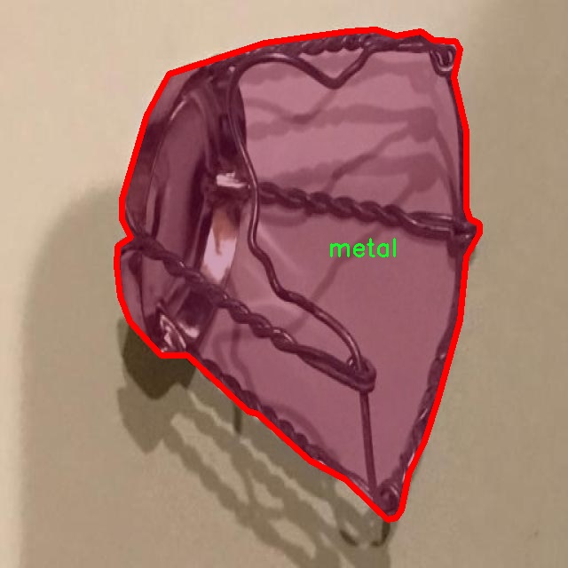

# 废弃物分类分割系统： yolov8-seg-RCSOSA

### 1.研究背景与意义

[参考博客](https://gitee.com/YOLOv8_YOLOv11_Segmentation_Studio/projects)

[博客来源](https://kdocs.cn/l/cszuIiCKVNis)

研究背景与意义

随着全球经济的快速发展和城市化进程的加快，废弃物的产生量急剧增加，如何有效地进行废弃物的分类与处理已成为当今社会面临的一项重要挑战。废弃物的分类不仅关乎资源的再利用与循环经济的发展，还直接影响到环境保护和可持续发展。因此，建立一个高效、准确的废弃物分类分割系统，能够为废弃物管理提供重要的技术支持，具有重要的现实意义。

近年来，深度学习技术的迅猛发展为图像处理领域带来了革命性的变化，尤其是在目标检测和实例分割任务中，基于卷积神经网络（CNN）的算法取得了显著的进展。YOLO（You Only Look Once）系列模型因其实时性和高精度而受到广泛关注，尤其是YOLOv8版本，其在目标检测和实例分割任务中展现出了优异的性能。然而，现有的YOLOv8模型在处理复杂背景和多类别废弃物的分类分割时，仍然存在一定的局限性。因此，基于改进YOLOv8的废弃物分类分割系统的研究，旨在提升模型在实际应用中的准确性和鲁棒性。

本研究将利用一个包含1700张图像的废弃物数据集，该数据集涵盖了金属、纸张和塑料三种类别。这一数据集的构建不仅为模型的训练提供了丰富的样本，也为后续的模型评估和优化奠定了基础。通过对该数据集的深入分析，我们可以识别出不同类别废弃物的特征，进而为模型的改进提供数据支持。针对YOLOv8模型的不足之处，我们将通过引入数据增强、改进损失函数以及优化网络结构等手段，提升模型在复杂环境下的分类与分割能力。

此外，废弃物的自动分类与分割技术在智能垃圾分类、资源回收和环境保护等领域具有广泛的应用前景。通过构建高效的废弃物分类分割系统，可以显著提高垃圾分类的效率，降低人工成本，并减少由于分类不当造成的资源浪费和环境污染。尤其是在城市垃圾管理中，智能化的分类系统能够帮助相关部门实现精细化管理，推动城市可持续发展。

综上所述，基于改进YOLOv8的废弃物分类分割系统的研究，不仅具有重要的学术价值，还具有显著的社会意义。通过这一研究，我们期望能够为废弃物管理提供一种新的解决方案，推动智能垃圾分类技术的发展，助力实现资源的高效利用和环境的可持续保护。

### 2.图片演示


注意：本项目提供完整的训练源码数据集和训练教程,由于此博客编辑较早,暂不提供权重文件（best.pt）,需要按照6.训练教程进行训练后实现上图效果。

### 3.视频演示

[3.1 视频演示](https://www.bilibili.com/video/BV1pEm9Y7Ey5/)

### 4.数据集信息

##### 4.1 数据集类别数＆类别名

nc: 3
names: ['metal', 'paper', 'plastic']


##### 4.2 数据集信息简介

数据集信息展示

在现代环境保护和资源回收的背景下，废弃物分类与分割技术的研究愈发重要。本研究所采用的数据集“projdeep2”专门用于训练改进YOLOv8-seg的废弃物分类分割系统，旨在提升对不同类型废弃物的识别和处理能力。该数据集的设计充分考虑了实际应用场景，包含了三种主要的废弃物类别：金属、纸张和塑料。这三类废弃物在日常生活中极为常见，且各自的回收和处理方式截然不同，因此在分类和分割任务中具有重要的研究价值。

“projdeep2”数据集的类别数量为三，具体类别列表包括：金属（metal）、纸张（paper）和塑料（plastic）。这些类别的选择不仅反映了废弃物的多样性，也为模型的训练提供了丰富的样本基础。金属废弃物通常包括铝罐、铁罐等，这些材料的回收再利用率较高，能够有效减少资源浪费；纸张废弃物则主要来源于包装材料、报纸和书籍等，回收后可再加工成再生纸；而塑料废弃物则涵盖了各种塑料瓶、袋子和包装材料，其对环境的影响不容忽视，因此对其进行有效分类和回收显得尤为重要。

在数据集的构建过程中，考虑到了不同类别废弃物的特征差异，确保每一类样本都具有代表性和多样性。这种多样性不仅体现在样本的外观特征上，还包括不同的拍摄角度、光照条件和背景环境。这种设计使得模型在训练过程中能够学习到更为丰富的特征，从而提高其在实际应用中的泛化能力。此外，数据集中的样本数量经过精心选择，以确保每一类都有足够的训练数据，避免因样本不足而导致的模型偏差。

为了进一步提升模型的性能，数据集“projdeep2”还包含了标注信息，涵盖了每个样本的类别标签及其在图像中的具体位置。这些标注信息对于YOLOv8-seg模型的训练至关重要，因为该模型依赖于精确的边界框和类别标签来进行学习。通过对这些信息的充分利用，模型能够在训练过程中逐步优化其分类和分割能力，从而实现对废弃物的高效识别和处理。

总之，数据集“projdeep2”不仅为改进YOLOv8-seg的废弃物分类分割系统提供了坚实的基础，也为未来的研究和应用开辟了新的方向。通过对金属、纸张和塑料等废弃物的深入分析与处理，我们希望能够在环境保护和资源回收领域取得更大的进展，推动可持续发展的目标实现。





### 5.项目依赖环境部署教程（零基础手把手教学）

[5.1 环境部署教程链接（零基础手把手教学）](https://www.bilibili.com/video/BV1jG4Ve4E9t/?vd_source=bc9aec86d164b67a7004b996143742dc)


[5.2 安装Python虚拟环境创建和依赖库安装视频教程链接（零基础手把手教学）](https://www.bilibili.com/video/BV1nA4VeYEze/?vd_source=bc9aec86d164b67a7004b996143742dc)

### 6.手把手YOLOV8-seg训练视频教程（零基础手把手教学）

[6.1 手把手YOLOV8-seg训练视频教程（零基础小白有手就能学会）](https://www.bilibili.com/video/BV1cA4VeYETe/?vd_source=bc9aec86d164b67a7004b996143742dc)


按照上面的训练视频教程链接加载项目提供的数据集，运行train.py即可开始训练



     Epoch   gpu_mem       box       obj       cls    labels  img_size
     1/200     0G   0.01576   0.01955  0.007536        22      1280: 100%|██████████| 849/849 [14:42<00:00,  1.04s/it]
               Class     Images     Labels          P          R     mAP@.5 mAP@.5:.95: 100%|██████████| 213/213 [01:14<00:00,  2.87it/s]
                 all       3395      17314      0.994      0.957      0.0957      0.0843

     Epoch   gpu_mem       box       obj       cls    labels  img_size
     2/200     0G   0.01578   0.01923  0.007006        22      1280: 100%|██████████| 849/849 [14:44<00:00,  1.04s/it]
               Class     Images     Labels          P          R     mAP@.5 mAP@.5:.95: 100%|██████████| 213/213 [01:12<00:00,  2.95it/s]
                 all       3395      17314      0.996      0.956      0.0957      0.0845

     Epoch   gpu_mem       box       obj       cls    labels  img_size
     3/200     0G   0.01561    0.0191  0.006895        27      1280: 100%|██████████| 849/849 [10:56<00:00,  1.29it/s]
               Class     Images     Labels          P          R     mAP@.5 mAP@.5:.95: 100%|███████   | 187/213 [00:52<00:00,  4.04it/s]
                 all       3395      17314      0.996      0.957      0.0957      0.0845


### 7.50+种全套YOLOV8-seg创新点加载调参实验视频教程（一键加载写好的改进模型的配置文件）

[7.1 50+种全套YOLOV8-seg创新点加载调参实验视频教程（一键加载写好的改进模型的配置文件）](https://www.bilibili.com/video/BV1Hw4VePEXv/?vd_source=bc9aec86d164b67a7004b996143742dc)

### YOLOV8-seg算法简介

原始YOLOv8-seg算法原理

YOLOv8-seg算法是YOLO系列目标检测模型的最新进展，基于YOLOv5和YOLOv7的架构，结合了轻量化设计和高效的特征提取机制，旨在实现更高的检测精度和速度。该算法的设计思路是通过优化网络结构和引入新技术，以适应日益复杂的视觉任务，尤其是在目标分割和检测领域。

首先，YOLOv8-seg的网络结构由四个主要模块组成：输入层、主干网络、特征融合层（Neck）和输出层（Head）。输入层负责对输入图像进行预处理，包括数据增强、缩放和填充等操作，以提高模型的鲁棒性和泛化能力。数据增强策略如马赛克增强和混合增强等，使得模型在训练过程中能够接触到多样化的样本，从而提高其对不同场景的适应能力。

在主干网络部分，YOLOv8-seg采用了CSPDarknet作为基础架构，并引入了C2f模块来替代传统的C3模块。C2f模块的设计灵感来源于YOLOv7的ELAN结构，旨在通过增加多个shortcut连接来缓解深层网络中的梯度消失问题。C2f模块由多个卷积层、归一化层和激活函数组成，能够有效提取图像的多层次特征。具体而言，C2f模块通过分支结构将特征图进行并行处理，增强了特征的重用性，并且在特征流动中保持了输入和输出的通道一致性，这对于后续的特征融合至关重要。

特征融合层（Neck）采用了PAN-FPN结构，旨在实现多尺度特征的高效融合。YOLOv8-seg通过自下而上的上采样和自上而下的下采样相结合，确保了不同层次特征的充分交互。该结构不仅保留了浅层特征的细节信息，还融合了高层特征的语义信息，从而提高了模型对目标的检测能力。通过对特征图进行横向连接，YOLOv8-seg能够有效整合来自不同尺度的信息，确保每一层的特征图都包含丰富的上下文信息。

在输出层，YOLOv8-seg采用了解耦头（Decoupled Head）结构，这一创新使得分类和回归任务可以独立进行，从而提高了检测的精度和效率。解耦头的设计灵活地处理了目标的边界框回归和类别预测，通过使用Distribution Focal Loss和CIoU Loss等损失函数，YOLOv8-seg能够更好地应对样本不平衡问题，尤其是在小目标检测中，显著提升了模型的学习效果。

YOLOv8-seg还引入了Anchor-Free的思想，抛弃了传统的Anchor-Based方法，这使得模型在处理复杂场景时更加灵活。通过Task-Aligned Assigner的匹配策略，YOLOv8-seg能够动态调整正负样本的匹配方式，从而优化训练过程，进一步提升检测精度。

在损失函数方面，YOLOv8-seg采用了VFLLoss作为分类损失，并结合DFLLoss和CIoULoss进行回归损失的计算。这种损失函数的组合不仅考虑了样本的类别信息，还关注了边界框的精确度，使得模型在目标检测任务中能够更好地平衡分类和定位的性能。

总体而言，YOLOv8-seg算法通过轻量化设计、特征融合和解耦结构的创新，成功地提高了目标检测的精度和速度，尤其在处理复杂背景和小目标时表现出色。该算法的成功应用不仅推动了目标检测技术的发展，也为未来的视觉任务提供了新的思路和方法。随着YOLOv8-seg的不断优化和迭代，预计其在实际应用中的表现将更加卓越，能够满足更广泛的需求和挑战。


### 9.系统功能展示（检测对象为举例，实际内容以本项目数据集为准）

图9.1.系统支持检测结果表格显示

  图9.2.系统支持置信度和IOU阈值手动调节

  图9.3.系统支持自定义加载权重文件best.pt(需要你通过步骤5中训练获得)

  图9.4.系统支持摄像头实时识别

  图9.5.系统支持图片识别

  图9.6.系统支持视频识别

  图9.7.系统支持识别结果文件自动保存

  图9.8.系统支持Excel导出检测结果数据


### 10.50+种全套YOLOV8-seg创新点原理讲解（非科班也可以轻松写刊发刊，V11版本正在科研待更新）

#### 10.1 由于篇幅限制，每个创新点的具体原理讲解就不一一展开，具体见下列网址中的创新点对应子项目的技术原理博客网址【Blog】：


[10.1 50+种全套YOLOV8-seg创新点原理讲解链接](https://gitee.com/qunmasj/good)

#### 10.2 部分改进模块原理讲解(完整的改进原理见上图和技术博客链接)【如果此小节的图加载失败可以通过CSDN或者Github搜索该博客的标题访问原始博客，原始博客图片显示正常】

### YOLOv8模型
YOLOv8模型由Ultralytics团队在YOLOv5模型的基础上，吸收了近两年半来经过实际验证的各种改进，于2023年1月提出。与之前的一些YOLO 系列模型想类似，YOLOv8模型也有多种尺寸，下面以YOLOv8n为例，分析 YOLOv8模型的结构和改进点。YOLOv8模型网络结构如
输入图片的部分，由于发现Mosaic数据增强尽管这有助于提升模型的鲁棒性和泛化性，但是，在一定程度上，也会破坏数据的真实分布，使得模型学习到一些不好的信息。所以YOLOv8模型在训练中的最后10个epoch 停止使用Mosaic数据增强。


在网络结构上，首先主干网络的改变不大，主要是将C3模块替换为了C2f模块，该模块的结构在上图中已示出。C2f模块在C3模块的思路基础上，引入了YOLOv7中 ELAN的思路，引入了更多的跳层连接，这有助于该模块获得更丰富的梯度流信息，而且模型的轻量化得到了保证。依然保留了SPPF，效果不变的同时减少了该模块的执行时间。
在颈部网络中，也是将所有的C3模块更改为C2f模块，同时删除了两处上采样之前的卷积连接层。
在头部网络中，采用了YOLOX中使用的解耦头的思路，两条并行的分支分别提取类别和位置特征。由于分类任务更注重于分析特征图中提取到的特征与已输入图片的部分，由于发现 Mosaic数据增强尽管这有助于提升模型的鲁棒性和泛化性，但是，在一定程度上，也会破坏数据的真实分布，使得模型学习到一些不好的信息。所以YOLOv8模型在训练中的最后10个epoch停止使用Mosaic数据增强。
在网络结构上，首先主干网络的改变不大，主要是将C3模块替换为了C2f模块，该模块的结构在上图中已示出。C2f模块在C3模块的思路基础上，引入了YOLOv7中ELAN的思路，引入了更多的跳层连接，这有助于该模块获得更丰富的梯度流信息，而且模型的轻量化得到了保证。依然保留了SPPF，效果不变的同时减少了该模块的执行时间。
在颈部网络中，也是将所有的C3模块更改为C2f模块，同时删除了两处上采样之前的卷积连接层。
在头部网络中，采用了YOLOX中使用的解耦头的思路，两条并行的分支分别提取类别和位置特征。由于分类任务更注重于分析特征图中提取到的特征与已有类别中的哪一种更为相似，而定位任务更关注边界框与真值框的位置关系，并据此对边界框的坐标进行调整。侧重点的不同使得在使用两个检测头时收敛的速度和预测的精度有所提高。而且使用了无锚框结构，直接预测目标的中心，并使用TAL (Task Alignment Learning，任务对齐学习）来区分正负样本，引入了分类分数和IOU的高次幂乘积作为衡量任务对齐程度的指标，认为同时拥有好的定位和分类评价的在分类和定位损失函数中也引入了这项指标。
在模型的检测结果上，YOLOv8模型也取得了较好的成果，图为官方在coCO数据集上 YOLOv8模型的模型尺寸大小和检测的mAP50-95对比图。mAP50-95指的是IOU的值从50%取到95%，步长为5%，然后算在这些IOU下的mAP的均值。图的 a）图展示了YOLOv8在同尺寸下模型中参数没有较大增加的前提下取得了比其他模型更好的精度，图2-17的b)图展示了YOLOv8比其他YOLO系列模型在同尺寸时，推理速度更快且精度没有太大下降。


### 视觉transformer(ViT)简介
视觉transformer(ViT)最近在各种计算机视觉任务中证明了巨大的成功，并受到了相当多的关注。与卷积神经网络(CNNs)相比，ViT具有更强的全局信息捕获能力和远程交互能力，表现出优于CNNs的准确性，特别是在扩大训练数据大小和模型大小时[An image is worth 16x16 words: Transformers for image recognition at scale,Coatnet]。

尽管ViT在低分辨率和高计算领域取得了巨大成功，但在高分辨率和低计算场景下，ViT仍不如cnn。例如，下图(左)比较了COCO数据集上当前基于cnn和基于vit的一级检测器。基于vit的检测器(160G mac)和基于cnn的检测器(6G mac)之间的效率差距超过一个数量级。这阻碍了在边缘设备的实时高分辨率视觉应用程序上部署ViT。


左图:现有的基于vit的一级检测器在实时目标检测方面仍然不如当前基于cnn的一级检测器，需要的计算量多出一个数量级。本文引入了第一个基于vit的实时对象检测器来弥补这一差距。在COCO上，efficientvit的AP比efficientdet高3.8，而mac较低。与YoloX相比，efficient ViT节省67.2%的计算成本，同时提供更高的AP。

中:随着输入分辨率的增加，计算成本呈二次增长，无法有效处理高分辨率的视觉应用。

右图:高分辨率对图像分割很重要。当输入分辨率从1024x2048降低到512x1024时，MobileNetV2的mIoU减少12% (8.5 mIoU)。在不提高分辨率的情况下，只提高模型尺寸是无法缩小性能差距的。

ViT的根本计算瓶颈是softmax注意模块，其计算成本随输入分辨率的增加呈二次增长。例如，如上图(中)所示，随着输入分辨率的增加，vit- small[Pytorch image models. https://github.com/rwightman/ pytorch-image-models]的计算成本迅速显著大于ResNet-152的计算成本。

解决这个问题的一个直接方法是降低输入分辨率。然而，高分辨率的视觉识别在许多现实世界的计算机视觉应用中是必不可少的，如自动驾驶，医疗图像处理等。当输入分辨率降低时，图像中的小物体和精细细节会消失，导致目标检测和语义分割性能显著下降。

上图(右)显示了在cityscape数据集上不同输入分辨率和宽度乘法器下MobileNetV2的性能。例如，将输入分辨率从1024x2048降低到512x1024会使cityscape的性能降低12% (8.5 mIoU)。即使是3.6倍高的mac，只放大模型尺寸而不增加分辨率也无法弥补这一性能损失。

除了降低分辨率外，另一种代表性的方法是限制softmax注意，方法是将其范围限制在固定大小的局部窗口内[Swin transformer,Swin transformer v2]或降低键/值张量的维数[Pyramid vision transformer,Segformer]。然而，它损害了ViT的非局部注意能力，降低了全局接受域(ViT最重要的优点)，使得ViT与大内核cnn的区别更小[A convnet for the 2020s,Scaling up your kernels to 31x31: Revisiting large kernel design in cnns,Lite pose: Efficient architecture design for 2d human pose estimation]。

本文介绍了一个有效的ViT体系结构，以解决这些挑战。发现没有必要坚持softmax注意力。本文建议用线性注意[Transformers are rnns: Fast autoregressive transformers with linear attention]代替softmax注意。

线性注意的关键好处是，它保持了完整的n 2 n^2n 2
 注意映射，就像softmax注意。同时，它利用矩阵乘法的联想特性，避免显式计算完整的注意映射，同时保持相同的功能。因此，它保持了softmax注意力的全局特征提取能力，且计算复杂度仅为线性。线性注意的另一个关键优点是它避免了softmax，这使得它在移动设备上更有效(下图左)。


左图:线性注意比类似mac下的softmax注意快3.3-4.5倍，这是因为去掉了硬件效率不高的softmax功能。延迟是在Qualcomm Snapdragon 855 CPU和TensorFlow-Lite上测量的。本文增加线性注意的头部数量，以确保它具有与softmax注意相似的mac。

中:然而，如果没有softmax注意中使用的非线性注意评分归一化，线性注意无法有效集中其注意分布，削弱了其局部特征提取能力。后文提供了可视化。

右图:本文用深度卷积增强线性注意，以解决线性注意的局限性。深度卷积可以有效地捕捉局部特征，而线性注意可以专注于捕捉全局信息。增强的线性注意在保持线性注意的效率和简单性的同时，表现出在各种视觉任务上的强大表现(图4)。

然而，直接应用线性注意也有缺点。以往的研究表明线性注意和softmax注意之间存在显著的性能差距(下图中间)。


左:高通骁龙855上的精度和延迟权衡。效率vit比效率网快3倍，精度更高。中:ImageNet上softmax注意与线性注意的比较。在相同的计算条件下，本文观察到softmax注意与线性注意之间存在显著的精度差距。而深度卷积增强模型后，线性注意的精度有明显提高。

相比之下，softmax注意的精度变化不大。在相同MAC约束下，增强线性注意比增强软最大注意提高了0.3%的精度。右图:与增强的softmax注意相比，增强的线性注意硬件效率更高，随着分辨率的增加，延迟增长更慢。

深入研究线性注意和softmax注意的详细公式，一个关键的区别是线性注意缺乏非线性注意评分归一化方案。这使得线性注意无法有效地将注意力分布集中在局部模式产生的高注意分数上，从而削弱了其局部特征提取能力。

本文认为这是线性注意的主要限制，使其性能不如softmax注意。本文提出了一个简单而有效的解决方案来解决这一限制，同时保持线性注意在低复杂度和低硬件延迟方面的优势。具体来说，本文建议通过在每个FFN层中插入额外的深度卷积来增强线性注意。因此，本文不需要依赖线性注意进行局部特征提取，避免了线性注意在捕捉局部特征方面的不足，并利用了线性注意在捕捉全局特征方面的优势。

本文广泛评估了efficient vit在低计算预算下对各种视觉任务的有效性，包括COCO对象检测、城市景观语义分割和ImageNet分类。本文想要突出高效的主干设计，所以没有包括任何正交的附加技术(例如，知识蒸馏，神经架构搜索)。尽管如此，在COCO val2017上，efficientvit的AP比efficientdet - d1高2.4倍，同时节省27.9%的计算成本。在cityscape上，efficientvit提供了比SegFormer高2.5个mIoU，同时降低了69.6%的计算成本。在ImageNet上，efficientvit在584M mac上实现了79.7%的top1精度，优于efficientnet - b1的精度，同时节省了16.6%的计算成本。

与现有的以减少参数大小或mac为目标的移动ViT模型[Mobile-former,Mobilevit,NASVit]不同，本文的目标是减少移动设备上的延迟。本文的模型不涉及复杂的依赖或硬件低效操作。因此，本文减少的计算成本可以很容易地转化为移动设备上的延迟减少。

在高通骁龙855 CPU上，efficient vit运行速度比efficientnet快3倍，同时提供更高的ImageNet精度。本文的代码和预训练的模型将在出版后向公众发布。

### Efficient Vision Transformer.
提高ViT的效率对于在资源受限的边缘平台上部署ViT至关重要，如手机、物联网设备等。尽管ViT在高计算区域提供了令人印象深刻的性能，但在针对低计算区域时，它通常不如以前高效的cnn[Efficientnet, mobilenetv3,Once for all: Train one network and specialize it for efficient deployment]。为了缩小差距，MobileViT建议结合CNN和ViT的长处，使用transformer将卷积中的局部处理替换为全局处理。MobileFormer提出了在MobileNet和Transformer之间建立双向桥以实现特征融合的并行化。NASViT提出利用神经架构搜索来搜索高效的ViT架构。

这些模型在ImageNet上提供了极具竞争力的准确性和效率的权衡。然而，它们并不适合高分辨率的视觉任务，因为它们仍然依赖于softmax注意力。


在本节中，本文首先回顾了自然语言处理中的线性注意，并讨论了它的优缺点。接下来，本文介绍了一个简单而有效的解决方案来克服线性注意的局限性。最后，给出了efficient vit的详细架构。

 为可学习投影矩阵。Oi表示矩阵O的第i行。Sim(·，·)为相似度函数。

虽然softmax注意力在视觉和NLP方面非常成功，但它并不是唯一的选择。例如，线性注意提出了如下相似度函数:


其中，φ(·)为核函数。在本工作中，本文选择了ReLU作为内核函数，因为它对硬件来说是友好的。当Sim(Q, K) = φ(Q)φ(K)T时，式(1)可改写为:


线性注意的一个关键优点是，它允许利用矩阵乘法的结合律，在不改变功能的情况下，将计算复杂度从二次型降低到线性型:


除了线性复杂度之外，线性注意的另一个关键优点是它不涉及注意模块中的softmax。Softmax在硬件上效率非常低。避免它可以显著减少延迟。例如，下图(左)显示了softmax注意和线性注意之间的延迟比较。在类似的mac上，线性注意力比移动设备上的softmax注意力要快得多。


#### EfficientViT
Enhancing Linear Attention with Depthwise Convolution

虽然线性注意在计算复杂度和硬件延迟方面优于softmax注意，但线性注意也有局限性。以往的研究[\[Luna: Linear unified nested attention,Random feature attention,Combiner: Full attention transformer with sparse computation cost,cosformer: Rethinking softmax in attention\]](https://afdian.net/item/602b9612927111ee9ec55254001e7c00)表明，在NLP中线性注意和softmax注意之间通常存在显著的性能差距。对于视觉任务，之前的研究[Visual correspondence hallucination,Quadtree attention for vision transformers]也表明线性注意不如softmax注意。在本文的实验中，本文也有类似的观察结果(图中)。


本文对这一假设提出了质疑，认为线性注意的低劣性能主要是由于局部特征提取能力的丧失。如果没有在softmax注意中使用的非线性评分归一化，线性注意很难像softmax注意那样集中其注意分布。下图(中间)提供了这种差异的示例。


在相同的原始注意力得分下，使用softmax比不使用softmax更能集中注意力。因此，线性注意不能有效地聚焦于局部模式产生的高注意分数(下图)，削弱了其局部特征提取能力。


注意图的可视化显示了线性注意的局限性。通过非线性注意归一化，softmax注意可以产生清晰的注意分布，如中间行所示。相比之下，线性注意的分布相对平滑，使得线性注意在捕捉局部细节方面的能力较弱，造成了显著的精度损失。本文通过深度卷积增强线性注意来解决这一限制，并有效提高了准确性。

介绍了一个简单而有效的解决方案来解决这个限制。本文的想法是用卷积增强线性注意，这在局部特征提取中是非常有效的。这样，本文就不需要依赖于线性注意来捕捉局部特征，而可以专注于全局特征提取。具体来说，为了保持线性注意的效率和简单性，本文建议在每个FFN层中插入一个深度卷积，这样计算开销很小，同时极大地提高了线性注意的局部特征提取能力。

#### Building Block

下图(右)展示了增强线性注意的详细架构，它包括一个线性注意层和一个FFN层，在FFN的中间插入深度卷积。


与之前的方法[Swin transformer,Coatnet]不同，本文在efficientvit中没有使用相对位置偏差。相对位置偏差虽然可以改善模型的性能，但它使模型容易受到分辨率变化[Segformer]的影响。多分辨率训练或新分辨率下的测试在检测和分割中很常见。去除相对位置偏差使高效率vit对输入分辨率更加灵活。

与之前低计算CNNs[Mobilenetv2,mobilenetv3]的设计不同，本文为下采样块添加了额外的下采样快捷方式。每个下采样快捷方式由一个平均池和一个1x1卷积组成。在本文的实验中，这些额外的下采样快捷方式可以稳定训练效率，提高性能。

#### Macro Architecture

下图说明了efficientvit的宏观体系结构。它由输入 stem 和4级组成。最近的研究[Coatnet,Levit,Early convolutions help transformers see better]表明在早期阶段使用卷积对ViT更好。本文遵循这个设计，在第三阶段开始使用增强的线性注意。


EfficientViT宏观架构。本文从第三阶段开始使用增强的线性注意。P2、P3和P4形成了一个金字塔特征图，用于检测和分割。P4用于分类。

为了突出高效的主干本身，本文对MBConv和FFN使用相同的扩展比e (e = 4)保持超参数简单，对所有深度卷积使用相同的内核大小k(除了输入stem)，对所有层使用相同的激活函数(hard swish)。

P2、P3和P4表示阶段2、3和4的输出，形成了特征图的金字塔。本文按照惯例将P2、P3和P4送至检测头。本文使用Yolov8进行检测。为了分割，本文融合了P2和P4。融合特征被馈送到一个轻量级头，包括几个卷积层，遵循Fast-SCNN。为了分类，本文将P4输入到轻量级头部，与MobileNetV3相同。


### 11.项目核心源码讲解（再也不用担心看不懂代码逻辑）

#### 11.1 ultralytics\utils\errors.py

以下是对给定代码的核心部分进行提炼和详细注释的结果：

```python
# 导入Ultralytics库中的emojis工具，用于处理信息中的表情符号
from ultralytics.utils import emojis

# 自定义异常类，用于处理与Ultralytics YOLO模型获取相关的错误
class HUBModelError(Exception):
    """
    自定义异常类，用于处理与模型获取相关的错误。

    当请求的模型未找到或无法检索时，将引发此异常。
    消息经过处理，以包含表情符号，从而提升用户体验。

    属性:
        message (str): 当异常被引发时显示的错误消息。

    注意:
        消息会通过'ultralytics.utils'包中的'emojis'函数自动处理。
    """

    def __init__(self, message='Model not found. Please check model URL and try again.'):
        """当模型未找到时创建异常实例。"""
        # 调用父类构造函数，并使用emojis函数处理消息
        super().__init__(emojis(message))
```

### 代码分析：
1. **导入部分**：
   - `from ultralytics.utils import emojis`：导入了一个工具函数`emojis`，用于在错误消息中添加表情符号，以增强用户体验。

2. **自定义异常类 `HUBModelError`**：
   - 该类继承自Python内置的`Exception`类，用于创建特定于Ultralytics YOLO模型的异常。
   - 类文档字符串详细描述了该异常的用途、属性和注意事项。

3. **构造函数 `__init__`**：
   - `message`参数提供了默认的错误消息，指示模型未找到。
   - 使用`super().__init__(emojis(message))`调用父类的构造函数，并通过`emojis`函数处理消息，以确保消息中包含表情符号。

### 总结：
这段代码定义了一个自定义异常类，用于处理在获取Ultralytics YOLO模型时可能出现的错误，并通过表情符号增强了错误消息的可读性和用户体验。

这个文件定义了一个自定义异常类 `HUBModelError`，用于处理与 Ultralytics YOLO 模型获取相关的错误。该异常主要在请求的模型未找到或无法检索时被抛出。异常类继承自 Python 的内置 `Exception` 类，意味着它可以像其他异常一样被捕获和处理。

在类的文档字符串中，详细说明了这个异常的用途和属性。它的主要属性是 `message`，这是在异常被抛出时显示的错误信息。默认情况下，这条信息是“Model not found. Please check model URL and try again.”，即“未找到模型。请检查模型 URL 并重试。” 

为了增强用户体验，错误信息会通过 `ultralytics.utils` 包中的 `emojis` 函数进行处理，这意味着错误信息中可能会包含一些表情符号，使得信息更加生动和易于理解。

在类的构造函数 `__init__` 中，调用了父类的构造函数，并将处理过的消息传递给它。这确保了当异常被实例化时，用户能够看到经过美化的错误信息。

总的来说，这个文件的主要功能是提供一个清晰、用户友好的方式来处理与模型获取相关的错误，增强了代码的可读性和用户体验。

#### 11.2 ultralytics\hub\__init__.py

以下是经过简化和注释的核心代码部分：

```python
# 导入所需的库
import requests
from ultralytics.hub.auth import Auth  # 导入身份验证模块
from ultralytics.utils import LOGGER, SETTINGS  # 导入日志记录和设置模块

def login(api_key=''):
    """
    使用提供的API密钥登录Ultralytics HUB API。

    参数:
        api_key (str, optional): API密钥或组合API密钥和模型ID。

    示例:
        hub.login('API_KEY')
    """
    Auth(api_key, verbose=True)  # 调用Auth类进行身份验证

def logout():
    """
    从Ultralytics HUB注销，移除设置文件中的API密钥。
    要再次登录，请使用'yolo hub login'。

    示例:
        hub.logout()
    """
    SETTINGS['api_key'] = ''  # 清空API密钥
    SETTINGS.save()  # 保存设置
    LOGGER.info("logged out ✅. To log in again, use 'yolo hub login'.")  # 记录注销信息

def reset_model(model_id=''):
    """将训练过的模型重置为未训练状态。"""
    # 向HUB API发送POST请求以重置模型
    r = requests.post(f'{HUB_API_ROOT}/model-reset', json={'apiKey': Auth().api_key, 'modelId': model_id})
    if r.status_code == 200:
        LOGGER.info('Model reset successfully')  # 记录重置成功信息
    else:
        LOGGER.warning(f'Model reset failure {r.status_code} {r.reason}')  # 记录重置失败信息

def export_model(model_id='', format='torchscript'):
    """将模型导出为指定格式。"""
    # 检查导出格式是否支持
    assert format in export_fmts_hub(), f"Unsupported export format '{format}'"
    # 向HUB API发送POST请求以导出模型
    r = requests.post(f'{HUB_API_ROOT}/v1/models/{model_id}/export',
                      json={'format': format},
                      headers={'x-api-key': Auth().api_key})
    assert r.status_code == 200, f'{format} export failure {r.status_code} {r.reason}'  # 检查导出请求是否成功
    LOGGER.info(f'{format} export started ✅')  # 记录导出开始信息

def check_dataset(path='', task='detect'):
    """
    在上传之前检查HUB数据集Zip文件的错误。

    参数:
        path (str, optional): 数据集Zip文件的路径，默认为''。
        task (str, optional): 数据集任务类型，默认为'detect'。

    示例:
        check_dataset('path/to/coco8.zip', task='detect')  # 检查检测数据集
    """
    # 使用HUBDatasetStats检查数据集的错误
    HUBDatasetStats(path=path, task=task).get_json()
    LOGGER.info('Checks completed correctly ✅. Upload this dataset to HUB.')  # 记录检查完成信息
```

### 代码核心部分说明：
1. **登录与注销功能**：提供了登录和注销Ultralytics HUB的功能，允许用户通过API密钥进行身份验证。
2. **模型重置**：可以将训练过的模型重置为未训练状态，便于重新训练或修改模型。
3. **模型导出**：支持将模型导出为多种格式，便于在不同环境中使用。
4. **数据集检查**：在上传数据集之前，检查数据集的有效性，确保数据集格式正确。

这个程序文件是Ultralytics YOLO框架的一部分，主要用于与Ultralytics HUB进行交互。它提供了一些功能，包括登录、登出、模型重置、模型导出和数据集检查等。

首先，文件中导入了一些必要的模块和工具，包括用于发送HTTP请求的`requests`库，以及一些来自Ultralytics库的工具和设置。这些工具和设置用于管理API的认证、日志记录和其他功能。

`login`函数允许用户通过提供API密钥来登录Ultralytics HUB。用户可以通过调用这个函数并传入API密钥来完成登录。函数内部会创建一个`Auth`对象，并显示登录信息。

`logout`函数用于登出Ultralytics HUB。它会清空存储在设置文件中的API密钥，并记录登出信息。用户在登出后可以使用`yolo hub login`命令重新登录。

`reset_model`函数用于将训练好的模型重置为未训练状态。它通过向HUB API发送POST请求来实现。如果请求成功，日志中会记录模型重置成功的信息；如果失败，则会记录警告信息。

`export_fmts_hub`函数返回一个支持的导出格式列表，用户可以通过这个列表了解可以将模型导出为哪些格式。

`export_model`函数用于将指定的模型导出为特定格式。它会检查所请求的格式是否被支持，并发送POST请求以执行导出操作。如果导出成功，日志中会记录相应的信息；如果失败，则会抛出异常。

`get_export`函数用于获取已导出的模型的字典，包括下载链接。它同样会检查所请求的格式是否被支持，并在成功获取后返回模型的JSON数据。

最后，`check_dataset`函数用于在上传数据集到HUB之前进行错误检查。它会检查指定路径下的ZIP文件是否符合要求，并在检查完成后记录信息，提示用户可以上传数据集。

总体来说，这个文件提供了一系列与Ultralytics HUB交互的功能，方便用户进行模型管理和数据集上传。

#### 11.3 model.py

以下是代码中最核心的部分，并附上详细的中文注释：

```python
# -*- coding: utf-8 -*-
import cv2  # 导入OpenCV库，用于处理图像和视频
import torch  # 导入PyTorch库，用于深度学习
from ultralytics import YOLO  # 从ultralytics库中导入YOLO类，用于加载YOLO模型
from ultralytics.utils.torch_utils import select_device  # 导入选择设备的工具函数

# 选择计算设备，如果有可用的GPU则使用CUDA，否则使用CPU
device = "cuda:0" if torch.cuda.is_available() else "cpu"

# 初始化参数字典
ini_params = {
    'device': device,  # 设备类型
    'conf': 0.3,  # 物体置信度阈值
    'iou': 0.05,  # 用于非极大值抑制的IOU阈值
    'classes': None,  # 类别过滤器
    'verbose': False  # 是否详细输出
}

class Web_Detector:  # 定义Web_Detector类
    def __init__(self, params=None):  # 构造函数
        self.model = None  # 初始化模型为None
        self.img = None  # 初始化图像为None
        self.params = params if params else ini_params  # 使用提供的参数或默认参数

    def load_model(self, model_path):  # 加载模型的方法
        self.device = select_device(self.params['device'])  # 选择计算设备
        self.model = YOLO(model_path)  # 加载YOLO模型
        # 预热模型，确保模型可以正常运行
        self.model(torch.zeros(1, 3, 640, 640).to(self.device).type_as(next(self.model.model.parameters())))

    def predict(self, img):  # 预测方法
        results = self.model(img, **ini_params)  # 使用模型进行预测
        return results  # 返回预测结果

    def postprocess(self, pred):  # 后处理方法
        results = []  # 初始化结果列表
        for res in pred[0].boxes:  # 遍历预测结果中的每个边界框
            class_id = int(res.cls.cpu())  # 获取类别ID
            bbox = res.xyxy.cpu().squeeze().tolist()  # 获取边界框坐标
            bbox = [int(coord) for coord in bbox]  # 转换边界框坐标为整数

            result = {
                "class_name": self.model.names[class_id],  # 类别名称
                "bbox": bbox,  # 边界框
                "score": res.conf.cpu().squeeze().item(),  # 置信度
                "class_id": class_id  # 类别ID
            }
            results.append(result)  # 将结果添加到列表

        return results  # 返回结果列表
```

### 代码说明：
1. **导入库**：导入必要的库，包括OpenCV、PyTorch和YOLO模型相关的库。
2. **设备选择**：根据是否有可用的GPU选择计算设备（CUDA或CPU）。
3. **参数初始化**：定义了一些初始化参数，如置信度阈值和IOU阈值。
4. **Web_Detector类**：定义了一个检测器类，包含模型加载、预测和后处理的方法。
   - `__init__`：构造函数，初始化模型和参数。
   - `load_model`：加载YOLO模型并进行预热。
   - `predict`：对输入图像进行预测，返回预测结果。
   - `postprocess`：对预测结果进行后处理，提取类别名称、边界框和置信度等信息，并返回结果列表。

这个程序文件`model.py`主要用于实现一个基于YOLO（You Only Look Once）模型的目标检测器。它利用OpenCV库处理图像和视频，并通过PyTorch框架进行深度学习模型的推理。程序的核心功能包括模型的加载、图像的预处理、目标的预测以及结果的后处理。

首先，程序导入了必要的库，包括OpenCV、PyTorch、YOLO模型以及一些自定义的模块。通过判断CUDA是否可用，程序选择在GPU或CPU上运行。接着，定义了一些初始化参数，如设备类型、置信度阈值、IOU阈值和类别过滤器等。

`count_classes`函数用于统计检测结果中每个类别的数量。它接收检测信息和类别名称列表作为输入，返回一个列表，表示每个类别的数量。这个函数通过遍历检测信息，更新每个类别的计数，并最终返回按类别名称顺序排列的计数列表。

接下来，定义了一个名为`Web_Detector`的类，该类继承自`Detector`。在构造函数中，初始化了一些属性，包括模型、图像和类别名称。`load_model`方法用于加载YOLO模型，选择设备并预热模型。它还将类别名称转换为中文，以便于后续使用。

`preprocess`方法用于对输入图像进行预处理，保存原始图像并返回处理后的图像。`predict`方法则调用YOLO模型进行目标检测，返回检测结果。

在`postprocess`方法中，对模型的预测结果进行后处理。它遍历预测结果中的每个边界框，提取类别ID、边界框坐标、置信度等信息，并将这些信息封装成字典形式，最终返回一个包含所有检测结果的列表。

最后，`set_param`方法用于更新检测器的参数，以便在不同的情况下调整模型的行为。

整体来看，这个程序文件实现了一个完整的目标检测流程，从模型加载到结果输出，适用于需要实时目标检测的应用场景。

#### 11.4 ultralytics\nn\backbone\efficientViT.py

以下是简化后的代码，保留了核心部分，并添加了详细的中文注释：

```python
import torch
import torch.nn as nn
import torch.nn.functional as F
import itertools

class Conv2d_BN(torch.nn.Sequential):
    """带有BatchNorm的卷积层"""
    def __init__(self, in_channels, out_channels, kernel_size=1, stride=1, padding=0, dilation=1, groups=1, bn_weight_init=1):
        super().__init__()
        # 添加卷积层
        self.add_module('conv', nn.Conv2d(in_channels, out_channels, kernel_size, stride, padding, dilation, groups, bias=False))
        # 添加BatchNorm层
        self.add_module('bn', nn.BatchNorm2d(out_channels))
        # 初始化BatchNorm的权重
        nn.init.constant_(self.bn.weight, bn_weight_init)
        nn.init.constant_(self.bn.bias, 0)

    @torch.no_grad()
    def switch_to_deploy(self):
        """将BatchNorm与卷积层融合以提高推理速度"""
        conv, bn = self._modules.values()
        w = bn.weight / (bn.running_var + bn.eps)**0.5
        w = conv.weight * w[:, None, None, None]
        b = bn.bias - bn.running_mean * bn.weight / (bn.running_var + bn.eps)**0.5
        # 创建新的卷积层并复制权重和偏置
        fused_conv = nn.Conv2d(w.size(1) * conv.groups, w.size(0), w.shape[2:], stride=conv.stride, padding=conv.padding, dilation=conv.dilation, groups=conv.groups)
        fused_conv.weight.data.copy_(w)
        fused_conv.bias.data.copy_(b)
        return fused_conv

class EfficientViTBlock(nn.Module):
    """EfficientViT的基本构建块"""
    def __init__(self, embed_dim, key_dim, num_heads=8, window_size=7):
        super().__init__()
        # 卷积层和前馈网络的残差连接
        self.dw = nn.Sequential(
            Conv2d_BN(embed_dim, embed_dim, kernel_size=3, stride=1, padding=1, groups=embed_dim),
            nn.ReLU()
        )
        self.ffn = nn.Sequential(
            Conv2d_BN(embed_dim, embed_dim * 2, kernel_size=1),
            nn.ReLU(),
            Conv2d_BN(embed_dim * 2, embed_dim, kernel_size=1)
        )
        # 注意力机制
        self.attn = LocalWindowAttention(embed_dim, key_dim, num_heads, window_size)

    def forward(self, x):
        """前向传播"""
        x = self.dw(x) + x  # 残差连接
        x = self.attn(x) + x  # 注意力机制
        x = self.ffn(x) + x  # 残差连接
        return x

class LocalWindowAttention(nn.Module):
    """局部窗口注意力机制"""
    def __init__(self, dim, key_dim, num_heads, window_size):
        super().__init__()
        self.attn = CascadedGroupAttention(dim, key_dim, num_heads, window_size)

    def forward(self, x):
        """前向传播"""
        return self.attn(x)

class CascadedGroupAttention(nn.Module):
    """级联组注意力机制"""
    def __init__(self, dim, key_dim, num_heads, window_size):
        super().__init__()
        self.num_heads = num_heads
        self.key_dim = key_dim
        self.scale = key_dim ** -0.5
        # 定义多个卷积层用于计算Q、K、V
        self.qkvs = nn.ModuleList([Conv2d_BN(dim // num_heads, key_dim * 2, window_size) for _ in range(num_heads)])
        self.dws = nn.ModuleList([Conv2d_BN(key_dim, key_dim, kernel_size=5, stride=1, padding=2, groups=key_dim) for _ in range(num_heads)])

    def forward(self, x):
        """前向传播"""
        B, C, H, W = x.shape
        feats_out = []
        for i, qkv in enumerate(self.qkvs):
            feat = qkv(x)
            q, k, v = feat.chunk(3, dim=1)  # 分割Q、K、V
            attn = (q @ k.transpose(-2, -1)) * self.scale  # 计算注意力
            attn = attn.softmax(dim=-1)  # softmax归一化
            feats_out.append(v @ attn.transpose(-2, -1))  # 加权求和
        return torch.cat(feats_out, dim=1)  # 合并所有头的输出

class EfficientViT(nn.Module):
    """EfficientViT模型"""
    def __init__(self, img_size=224, embed_dim=[64, 128, 192], depth=[1, 2, 3], num_heads=[4, 4, 4], window_size=7):
        super().__init__()
        self.patch_embed = Conv2d_BN(3, embed_dim[0] // 8, kernel_size=3, stride=2, padding=1)
        self.blocks = nn.ModuleList()
        for i in range(len(depth)):
            for _ in range(depth[i]):
                self.blocks.append(EfficientViTBlock(embed_dim[i], embed_dim[i] // num_heads[i], num_heads[i], window_size))

    def forward(self, x):
        """前向传播"""
        x = self.patch_embed(x)
        for block in self.blocks:
            x = block(x)
        return x

# 示例用法
if __name__ == '__main__':
    model = EfficientViT()
    inputs = torch.randn((1, 3, 224, 224))  # 输入张量
    res = model(inputs)  # 前向传播
    print(res.size())  # 输出结果的尺寸
```

### 代码注释说明：
1. **Conv2d_BN**: 这是一个带有Batch Normalization的卷积层的实现。它在初始化时创建卷积层和BatchNorm层，并在`switch_to_deploy`方法中实现了卷积和BatchNorm的融合，以提高推理速度。
2. **EfficientViTBlock**: 这是EfficientViT的基本构建块，包含卷积层、前馈网络和局部窗口注意力机制。通过残差连接来增强模型的表达能力。
3. **LocalWindowAttention**: 实现局部窗口注意力机制的类，使用级联组注意力来计算注意力权重。
4. **CascadedGroupAttention**: 级联组注意力机制的实现，计算Q、K、V并进行注意力计算。
5. **EfficientViT**: 整个EfficientViT模型的实现，包含多个构建块和一个初始的卷积层用于图像嵌入。

以上代码保留了EfficientViT模型的核心结构，并进行了简化和注释，便于理解。

这个程序文件实现了一个名为EfficientViT的深度学习模型架构，主要用于图像处理任务。该模型的设计灵感来源于视觉Transformer（ViT），并通过引入高效的卷积和注意力机制来提高性能。

文件开头部分包含了一些版权信息和必要的库导入，包括PyTorch和一些用于模型构建的模块。接下来，定义了一些模型组件，例如Conv2d_BN类，该类结合了卷积层和批归一化层，并提供了一个方法用于在推理阶段将其转换为更高效的形式。

接下来的PatchMerging类用于将输入特征图进行合并，增强模型的表达能力。Residual类实现了残差连接，允许模型在训练时通过随机丢弃部分连接来提高鲁棒性。FFN类则实现了前馈神经网络，包含两个卷积层和一个激活函数。

CascadedGroupAttention和LocalWindowAttention类实现了不同类型的注意力机制，前者通过级联的方式增强特征表示，后者则在局部窗口内进行注意力计算，以减少计算复杂度。EfficientViTBlock类则将这些组件组合在一起，形成EfficientViT的基本构建块。

EfficientViT类是整个模型的核心，负责构建模型的各个层次，包括输入的嵌入层、多个EfficientViTBlock以及特征的输出。模型的构造参数如图像大小、补丁大小、嵌入维度、深度等都可以通过参数进行调整，以适应不同的任务需求。

文件末尾定义了一些预设的模型配置，如EfficientViT_m0到EfficientViT_m5，这些配置包含了不同的超参数设置。随后，定义了一系列函数用于创建不同版本的EfficientViT模型，并支持加载预训练权重和批归一化层的融合。

最后的主程序部分展示了如何实例化EfficientViT模型，并通过随机生成的输入数据进行前向传播，输出各层的特征图大小。这段代码的执行可以用于验证模型的构建是否正确。整体而言，该文件实现了一个高效且灵活的视觉Transformer模型，适用于各种下游任务。

#### 11.5 ultralytics\nn\extra_modules\dynamic_snake_conv.py

以下是经过简化和注释的核心代码部分：

```python
import torch
import torch.nn as nn

class DySnakeConv(nn.Module):
    def __init__(self, inc, ouc, k=3) -> None:
        super().__init__()
        # 初始化三个卷积层：标准卷积和两个动态蛇形卷积
        self.conv_0 = Conv(inc, ouc, k)  # 标准卷积
        self.conv_x = DSConv(inc, ouc, 0, k)  # 沿x轴的动态蛇形卷积
        self.conv_y = DSConv(inc, ouc, 1, k)  # 沿y轴的动态蛇形卷积
    
    def forward(self, x):
        # 前向传播，将三个卷积的输出在通道维度上拼接
        return torch.cat([self.conv_0(x), self.conv_x(x), self.conv_y(x)], dim=1)

class DSConv(nn.Module):
    def __init__(self, in_ch, out_ch, morph, kernel_size=3, if_offset=True, extend_scope=1):
        super(DSConv, self).__init__()
        # 用于学习可变形偏移的卷积层
        self.offset_conv = nn.Conv2d(in_ch, 2 * kernel_size, 3, padding=1)
        self.bn = nn.BatchNorm2d(2 * kernel_size)  # 批归一化
        self.kernel_size = kernel_size

        # 定义沿x轴和y轴的动态蛇形卷积
        self.dsc_conv_x = nn.Conv2d(in_ch, out_ch, kernel_size=(kernel_size, 1), stride=(kernel_size, 1), padding=0)
        self.dsc_conv_y = nn.Conv2d(in_ch, out_ch, kernel_size=(1, kernel_size), stride=(1, kernel_size), padding=0)

        self.extend_scope = extend_scope  # 偏移范围
        self.morph = morph  # 卷积核的形态
        self.if_offset = if_offset  # 是否使用偏移

    def forward(self, f):
        # 计算偏移量
        offset = self.offset_conv(f)
        offset = self.bn(offset)
        offset = torch.tanh(offset)  # 将偏移量限制在[-1, 1]之间

        # 进行动态蛇形卷积
        dsc = DSC(f.shape, self.kernel_size, self.extend_scope, self.morph)
        deformed_feature = dsc.deform_conv(f, offset, self.if_offset)

        # 根据形态选择相应的卷积操作
        if self.morph == 0:
            x = self.dsc_conv_x(deformed_feature.type(f.dtype))
        else:
            x = self.dsc_conv_y(deformed_feature.type(f.dtype))
        
        return x

class DSC(object):
    def __init__(self, input_shape, kernel_size, extend_scope, morph):
        self.num_points = kernel_size  # 卷积核的大小
        self.width = input_shape[2]  # 输入特征图的宽度
        self.height = input_shape[3]  # 输入特征图的高度
        self.morph = morph  # 卷积核的形态
        self.extend_scope = extend_scope  # 偏移范围

        # 定义特征图的形状
        self.num_batch = input_shape[0]  # 批量大小
        self.num_channels = input_shape[1]  # 通道数

    def deform_conv(self, input, offset, if_offset):
        # 计算坐标图
        y, x = self._coordinate_map_3D(offset, if_offset)
        # 进行双线性插值以获得变形后的特征图
        deformed_feature = self._bilinear_interpolate_3D(input, y, x)
        return deformed_feature

    def _coordinate_map_3D(self, offset, if_offset):
        # 计算3D坐标图，返回变形后的y和x坐标
        # 省略具体实现，主要是计算变形的坐标
        pass

    def _bilinear_interpolate_3D(self, input_feature, y, x):
        # 进行3D双线性插值，返回插值后的特征图
        # 省略具体实现，主要是根据y和x坐标进行插值
        pass
```

### 代码说明：
1. **DySnakeConv**：主卷积模块，包含一个标准卷积和两个动态蛇形卷积，分别处理不同方向的特征。
2. **DSConv**：动态蛇形卷积模块，使用可变形卷积来处理输入特征图，通过学习偏移量来改变卷积核的形状。
3. **DSC**：负责计算变形后的坐标和进行双线性插值的类，具体实现细节被省略。
4. **偏移量计算**：通过卷积和批归一化获得偏移量，并将其限制在[-1, 1]之间。
5. **动态卷积**：根据形态选择不同的卷积操作，处理变形后的特征图。

这个程序文件定义了一个动态蛇形卷积（Dynamic Snake Convolution）模块，主要用于深度学习中的卷积操作。文件中包含两个主要的类：`DySnakeConv` 和 `DSConv`，以及一个辅助类 `DSC`。

`DySnakeConv` 类是一个卷积层的组合，它在初始化时接收输入通道数 `inc`、输出通道数 `ouc` 和卷积核大小 `k`。在其构造函数中，定义了三个卷积操作：`conv_0` 是标准卷积，`conv_x` 和 `conv_y` 是动态蛇形卷积，分别沿着 x 轴和 y 轴进行操作。在前向传播方法 `forward` 中，输入 `x` 经过这三个卷积操作后，结果在通道维度上进行拼接，形成一个新的特征图。

`DSConv` 类实现了动态蛇形卷积的具体逻辑。它的构造函数接收输入通道数、输出通道数、卷积核大小、形态参数、是否需要偏移以及扩展范围等参数。该类内部使用了一个卷积层 `offset_conv` 来学习可变形的偏移量，并通过批归一化 `bn` 对偏移量进行处理。根据形态参数的不同，`DSConv` 可以选择沿 x 轴或 y 轴进行卷积操作。

在 `forward` 方法中，首先计算偏移量，然后通过 `DSC` 类生成坐标图，并进行双线性插值以获得变形后的特征图。最后，根据形态参数的不同，选择相应的卷积操作并返回结果。

`DSC` 类是一个辅助类，负责生成坐标图和进行双线性插值。它的构造函数接收输入特征图的形状、卷积核大小、扩展范围和形态参数。在 `_coordinate_map_3D` 方法中，根据偏移量生成新的坐标图，并考虑了偏移的范围和形态。`_bilinear_interpolate_3D` 方法则实现了双线性插值，利用生成的坐标图对输入特征图进行变形处理。

总体而言，这个文件实现了一个复杂的卷积操作，能够根据输入特征图的特征动态调整卷积核的位置，从而提高模型对形状变化的适应能力。该模块可以在图像处理、目标检测等任务中发挥重要作用。

### 12.系统整体结构（节选）

### 程序整体功能和构架概括

该程序主要实现了一个基于Ultralytics YOLO框架的目标检测系统，结合了多种深度学习模型和模块，提供了从模型加载、目标检测到自定义卷积操作的完整功能。程序结构清晰，模块化设计使得各个功能独立且易于维护。以下是各个文件的主要功能概述：

1. **错误处理**：提供自定义异常类，用于处理与模型获取相关的错误。
2. **HUB交互**：实现与Ultralytics HUB的交互功能，包括登录、登出、模型导出等。
3. **目标检测**：实现YOLO模型的加载、图像预处理、目标预测和结果后处理。
4. **EfficientViT模型**：实现了一种高效的视觉Transformer模型，适用于图像处理任务。
5. **动态蛇形卷积**：实现了一种动态卷积操作，能够根据输入特征图的特征动态调整卷积核的位置。

### 文件功能整理表

| 文件路径                                          | 功能描述                                                         |
|--------------------------------------------------|------------------------------------------------------------------|
| `ultralytics/utils/errors.py`                   | 定义自定义异常类 `HUBModelError`，用于处理模型获取相关的错误。 |
| `ultralytics/hub/__init__.py`                   | 实现与Ultralytics HUB的交互功能，包括登录、登出、模型导出等。   |
| `model.py`                                       | 实现YOLO模型的加载、图像预处理、目标预测和结果后处理。         |
| `ultralytics/nn/backbone/efficientViT.py`      | 实现EfficientViT模型架构，适用于图像处理任务。                 |
| `ultralytics/nn/extra_modules/dynamic_snake_conv.py` | 实现动态蛇形卷积模块，能够根据输入特征图动态调整卷积核位置。    |

通过以上表格，可以清晰地看到每个文件的功能和作用，为理解整个程序的架构提供了有力的支持。

### 13.图片、视频、摄像头图像分割Demo(去除WebUI)代码

在这个博客小节中，我们将讨论如何在不使用WebUI的情况下，实现图像分割模型的使用。本项目代码已经优化整合，方便用户将分割功能嵌入自己的项目中。
核心功能包括图片、视频、摄像头图像的分割，ROI区域的轮廓提取、类别分类、周长计算、面积计算、圆度计算以及颜色提取等。
这些功能提供了良好的二次开发基础。

### 核心代码解读

以下是主要代码片段，我们会为每一块代码进行详细的批注解释：

```python
import random
import cv2
import numpy as np
from PIL import ImageFont, ImageDraw, Image
from hashlib import md5
from model import Web_Detector
from chinese_name_list import Label_list

# 根据名称生成颜色
def generate_color_based_on_name(name):
    ......

# 计算多边形面积
def calculate_polygon_area(points):
    return cv2.contourArea(points.astype(np.float32))

...
# 绘制中文标签
def draw_with_chinese(image, text, position, font_size=20, color=(255, 0, 0)):
    image_pil = Image.fromarray(cv2.cvtColor(image, cv2.COLOR_BGR2RGB))
    draw = ImageDraw.Draw(image_pil)
    font = ImageFont.truetype("simsun.ttc", font_size, encoding="unic")
    draw.text(position, text, font=font, fill=color)
    return cv2.cvtColor(np.array(image_pil), cv2.COLOR_RGB2BGR)

# 动态调整参数
def adjust_parameter(image_size, base_size=1000):
    max_size = max(image_size)
    return max_size / base_size

# 绘制检测结果
def draw_detections(image, info, alpha=0.2):
    name, bbox, conf, cls_id, mask = info['class_name'], info['bbox'], info['score'], info['class_id'], info['mask']
    adjust_param = adjust_parameter(image.shape[:2])
    spacing = int(20 * adjust_param)

    if mask is None:
        x1, y1, x2, y2 = bbox
        aim_frame_area = (x2 - x1) * (y2 - y1)
        cv2.rectangle(image, (x1, y1), (x2, y2), color=(0, 0, 255), thickness=int(3 * adjust_param))
        image = draw_with_chinese(image, name, (x1, y1 - int(30 * adjust_param)), font_size=int(35 * adjust_param))
        y_offset = int(50 * adjust_param)  # 类别名称上方绘制，其下方留出空间
    else:
        mask_points = np.concatenate(mask)
        aim_frame_area = calculate_polygon_area(mask_points)
        mask_color = generate_color_based_on_name(name)
        try:
            overlay = image.copy()
            cv2.fillPoly(overlay, [mask_points.astype(np.int32)], mask_color)
            image = cv2.addWeighted(overlay, 0.3, image, 0.7, 0)
            cv2.drawContours(image, [mask_points.astype(np.int32)], -1, (0, 0, 255), thickness=int(8 * adjust_param))

            # 计算面积、周长、圆度
            area = cv2.contourArea(mask_points.astype(np.int32))
            perimeter = cv2.arcLength(mask_points.astype(np.int32), True)
            ......

            # 计算色彩
            mask = np.zeros(image.shape[:2], dtype=np.uint8)
            cv2.drawContours(mask, [mask_points.astype(np.int32)], -1, 255, -1)
            color_points = cv2.findNonZero(mask)
            ......

            # 绘制类别名称
            x, y = np.min(mask_points, axis=0).astype(int)
            image = draw_with_chinese(image, name, (x, y - int(30 * adjust_param)), font_size=int(35 * adjust_param))
            y_offset = int(50 * adjust_param)

            # 绘制面积、周长、圆度和色彩值
            metrics = [("Area", area), ("Perimeter", perimeter), ("Circularity", circularity), ("Color", color_str)]
            for idx, (metric_name, metric_value) in enumerate(metrics):
                ......

    return image, aim_frame_area

# 处理每帧图像
def process_frame(model, image):
    pre_img = model.preprocess(image)
    pred = model.predict(pre_img)
    det = pred[0] if det is not None and len(det)
    if det:
        det_info = model.postprocess(pred)
        for info in det_info:
            image, _ = draw_detections(image, info)
    return image

if __name__ == "__main__":
    cls_name = Label_list
    model = Web_Detector()
    model.load_model("./weights/yolov8s-seg.pt")

    # 摄像头实时处理
    cap = cv2.VideoCapture(0)
    while cap.isOpened():
        ret, frame = cap.read()
        if not ret:
            break
        ......

    # 图片处理
    image_path = './icon/OIP.jpg'
    image = cv2.imread(image_path)
    if image is not None:
        processed_image = process_frame(model, image)
        ......

    # 视频处理
    video_path = ''  # 输入视频的路径
    cap = cv2.VideoCapture(video_path)
    while cap.isOpened():
        ret, frame = cap.read()
        ......
```


### 14.完整训练+Web前端界面+50+种创新点源码、数据集获取


# [下载链接：https://mbd.pub/o/bread/Z5aVlZZq](https://mbd.pub/o/bread/Z5aVlZZq)